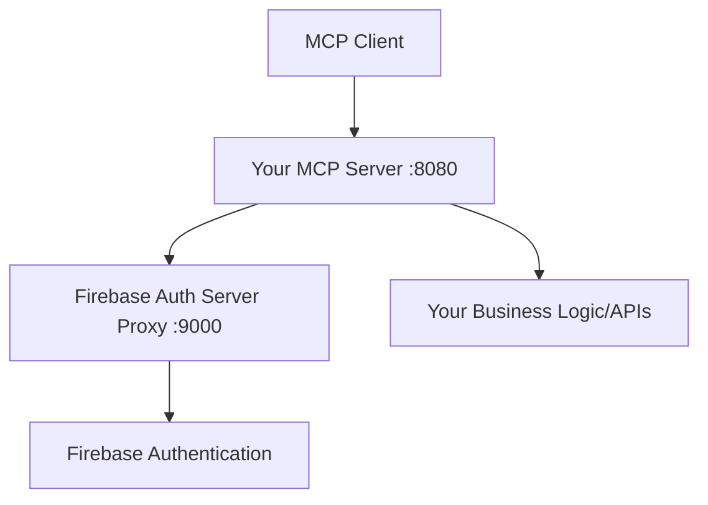

# Chapter 3: OAuth2 Integration with MCP Firebase Auth Proxy

This chapter extends Chapter 2 by integrating OAuth2 authentication flows using an external Firebase Auth Proxy server. This enables automatic authentication for MCP clients without manual token management.

## Overview

Chapter 3 introduces:
- OAuth2 Resource Server configuration
- Integration with MCP Firebase Auth Proxy
- OAuth2 Protected Resource Metadata endpoint
- Custom authentication entry point for MCP flows
- Automatic token validation and user context



## Step 1: MCP Firebase Auth Proxy Setup

### Using the Hosted Proxy Server
We provide a hosted MCP Auth Server Proxy for Firebase:
**URL**: https://mcpfirebaseauthserver.muthuishere.site/

This OAuth2 authentication server:
- Supports Dynamic Client Registration (DCR)
- Integrates Firebase Authentication with MCP
- Handles OAuth2 flows automatically
- Provides secure authentication for MCP servers and clients

### Why Use the Proxy?
- Your existing app can get Firebase tokens but doesn't prompt user login
- The proxy handles the OAuth2 flow and user authentication
- Enables seamless integration with MCP clients that support OAuth2

## Step 2: Update Configuration Properties

Add OAuth2 and MCP-specific configuration to `application.properties`:

```properties
# MCP Server Configuration - Override via environment variables
# MCP Resource Server Base URL
mcp.server.base-url=${MCP_SERVER_BASE_URL:http://localhost:8080}

# MCP Authorization Server Base URL (Firebase Auth Proxy)
mcp.auth.server.base-url=${MCP_AUTH_SERVER_URL:http://localhost:9000}

# MCP Server MCP URL
mcp.server.mcp-url=${mcp.server.base-url}/mcp

# Authorization URLs
mcp.authorization.server.authorize-url=${mcp.auth.server.base-url}/oauth/authorize
```

## Step 3: Create OAuth2 Authentication Entry Point

### MCP Authentication Entry Point (`McpAuthenticationEntryPoint.java`)

```java
package tools.muthuishere.todo.oauth;

import jakarta.servlet.http.HttpServletRequest;
import jakarta.servlet.http.HttpServletResponse;
import java.io.IOException;
import org.springframework.beans.factory.annotation.Value;
import org.springframework.security.core.AuthenticationException;
import org.springframework.security.web.AuthenticationEntryPoint;
import org.springframework.stereotype.Component;

/**
 * Custom AuthenticationEntryPoint for MCP Authorization flow
 * Returns WWW-Authenticate header pointing to our Firebase Auth Proxy server
 * when JWT token is invalid/missing
 */
@Component
public class McpAuthenticationEntryPoint implements AuthenticationEntryPoint {

    @Value("${mcp.server.base-url}")
    private String mcpServerBaseUrl;

    @Override
    public void commence(
        HttpServletRequest request,
        HttpServletResponse response,
        AuthenticationException authException
    ) throws IOException {
        String resourceMetadataUrl =
            mcpServerBaseUrl + "/.well-known/oauth-protected-resource";

        // Set WWW-Authenticate header as per RFC 6750 and RFC 8707
        response.setHeader(
            "WWW-Authenticate",
            "Bearer error=\"invalid_request\", " +
                "error_description=\"No access token was provided in this request\", " +
                "resource_metadata=\"" +
                resourceMetadataUrl +
                "\""
        );

        response.setStatus(HttpServletResponse.SC_UNAUTHORIZED);
        response.setContentType("application/json");

        String jsonResponse = """
            {
                "error": "invalid_request",
                "error_description": "No access token was provided in this request",
                "resource_metadata": "%s"
            }
            """.formatted(resourceMetadataUrl);

        response.getWriter().write(jsonResponse);
    }
}
```

## Step 4: Create Resource Metadata Controller

### OAuth2 Protected Resource Metadata (`ResourceMetadataController.java`)

```java
package tools.muthuishere.todo.oauth;

import java.util.Map;
import org.springframework.beans.factory.annotation.Value;
import org.springframework.http.MediaType;
import org.springframework.http.ResponseEntity;
import org.springframework.web.bind.annotation.GetMapping;
import org.springframework.web.bind.annotation.RestController;

@RestController
public class ResourceMetadataController {

    @Value("${mcp.auth.server.base-url}")
    private String authServerBaseUrl;

    @Value("${mcp.server.mcp-url}")
    private String mcpUrl;

    /**
     * OAuth 2.0 Protected Resource Metadata endpoint (without /mcp/)
     * Required for MCP Inspector discovery
     */
    @GetMapping(
        value = "/.well-known/oauth-protected-resource",
        produces = MediaType.APPLICATION_JSON_VALUE
    )
    public ResponseEntity<Map<String, Object>> getGenericResourceMetadata() {
        Map<String, Object> metadata = new java.util.HashMap<>();
        metadata.put("resource_name", "Todo MCP Server");
        metadata.put("resource", mcpUrl);
        metadata.put(
            "authorization_servers",
            new String[] { authServerBaseUrl }
        );
        metadata.put("bearer_methods_supported", new String[] { "header" });
        metadata.put("scopes_supported", new String[] { "read:email" });
        return ResponseEntity.ok(metadata);
    }
}
```

## Step 5: Update Security Configuration

### Enhanced Security Config (`SecurityConfig.java`)

```java
package tools.muthuishere.todo.config;

import java.util.Arrays;
import org.springframework.beans.factory.annotation.Autowired;
import org.springframework.context.annotation.Bean;
import org.springframework.context.annotation.Configuration;
import org.springframework.security.config.Customizer;
import org.springframework.security.config.annotation.web.builders.HttpSecurity;
import org.springframework.security.config.annotation.web.configuration.EnableWebSecurity;
import org.springframework.security.config.annotation.web.configurers.AbstractHttpConfigurer;
import org.springframework.security.config.http.SessionCreationPolicy;
import org.springframework.security.oauth2.jwt.JwtDecoder;
import org.springframework.security.web.SecurityFilterChain;
import org.springframework.web.cors.CorsConfiguration;
import org.springframework.web.cors.CorsConfigurationSource;
import org.springframework.web.cors.UrlBasedCorsConfigurationSource;
import tools.muthuishere.todo.oauth.McpAuthenticationEntryPoint;

@Configuration
@EnableWebSecurity
public class SecurityConfig {

    @Autowired
    private McpAuthenticationEntryPoint mcpAuthenticationEntryPoint;

    @Bean
    public SecurityFilterChain filterChain(HttpSecurity http) throws Exception {
        return http
            .csrf(AbstractHttpConfigurer::disable)
            .cors(Customizer.withDefaults())
            .sessionManagement(session ->
                session.sessionCreationPolicy(SessionCreationPolicy.STATELESS)
            )
            .authorizeHttpRequests(auth ->
                auth
                    // Public endpoints - OAuth metadata and health
                    .requestMatchers("/", "/api/health", "/.well-known/**")
                    .permitAll()
                    // All other endpoints require authentication
                    .anyRequest()
                    .authenticated()
            )
            .oauth2ResourceServer(oauth2 ->
                oauth2
                    .jwt(jwt -> jwt.decoder(jwtDecoder()))
                    .authenticationEntryPoint(mcpAuthenticationEntryPoint)
            )
            .build();
    }

    @Bean
    public JwtDecoder jwtDecoder() {
        // Firebase JWT tokens are signed with RS256
        // We'll create a custom decoder that validates Firebase tokens
        return new FirebaseJwtDecoder();
    }

    @Bean
    public CorsConfigurationSource corsConfigurationSource() {
        CorsConfiguration configuration = new CorsConfiguration();
        configuration.setAllowedOriginPatterns(Arrays.asList("*"));
        configuration.setAllowedMethods(
            Arrays.asList("GET", "POST", "PUT", "DELETE", "OPTIONS")
        );
        configuration.setAllowedHeaders(Arrays.asList("*"));
        configuration.setAllowCredentials(true);

        UrlBasedCorsConfigurationSource source =
            new UrlBasedCorsConfigurationSource();
        source.registerCorsConfiguration("/**", configuration);
        return source;
    }
}
```

### Key Changes from Chapter 2:
1. **Public Endpoints**: Added `/.well-known/**` to permitted paths for OAuth2 metadata discovery
2. **OAuth2 Resource Server**: Added `.oauth2ResourceServer()` configuration with custom authentication entry point
3. **Custom Entry Point**: Integrated `McpAuthenticationEntryPoint` to handle unauthorized requests with proper OAuth2 headers

## Step 6: OAuth2 Flow Integration

### How It Works

1. **Discovery**: MCP clients discover your server's OAuth2 capabilities via `/.well-known/oauth-protected-resource`
2. **Authentication**: When unauthorized, clients receive WWW-Authenticate headers pointing to the auth server
3. **Token Exchange**: Clients authenticate with the Firebase Auth Proxy and receive JWT tokens
4. **API Access**: Clients use JWT tokens to access your MCP server endpoints

### Environment Variables

Set these environment variables for your deployment:

```bash
# Your MCP server URL
MCP_SERVER_BASE_URL=http://localhost:8080

# Firebase Auth Proxy URL
MCP_AUTH_SERVER_URL=https://mcpfirebaseauthserver.muthuishere.site

# Firebase Configuration (same as Chapter 2)
FIREBASE_PROJECT_ID=your-project-id
FIREBASE_API_KEY=your-api-key
FIREBASE_SERVICE_ACCOUNT_KEY='{"type":"service_account",...}'
```

## Step 7: Testing OAuth2 Integration

### MCP Client Configuration

#### VSCode MCP Client
```json
{
  "mcpServers": {
    "todo-mcp-server-oauth": {
      "httpUrl": "http://localhost:8080/mcp",
      "type": "http"

    }
  }
}
```


### Manual Testing

1. **Access Protected Endpoint**:
   ```bash
   curl -i http://localhost:8080/mcp
   ```

2. **Expected Response**:
   ```
   HTTP/1.1 401 Unauthorized
   WWW-Authenticate: Bearer error="invalid_request", error_description="No access token was provided in this request", resource_metadata="http://localhost:8080/.well-known/oauth-protected-resource"
   ```

3. **Check Metadata Endpoint**:
   ```bash
   curl http://localhost:8080/.well-known/oauth-protected-resource
   ```

4. **Expected Metadata Response**:
   ```json
   {
     "resource_name": "Todo MCP Server",
     "resource": "http://localhost:8080/mcp",
     "authorization_servers": ["https://mcpfirebaseauthserver.muthuishere.site"],
     "bearer_methods_supported": ["header"],
     "scopes_supported": ["read:email"]
   }
   ```

## Step 8: Running the Application

### Start Your MCP Server
```bash
./gradlew bootRun
```

### Verify OAuth2 Integration
1. Access the metadata endpoint to ensure it's publicly available
2. Try accessing protected endpoints to verify authentication is required
3. Test with an MCP client that supports OAuth2

## Summary

### Key Features Added in Chapter 3:

1. **OAuth2 Resource Server**: Full OAuth2 integration for automatic authentication flows
2. **Resource Metadata Endpoint**: Standards-compliant discovery mechanism for MCP clients
3. **Custom Authentication Entry Point**: Proper error responses with OAuth2 headers
4. **Firebase Auth Proxy Integration**: Seamless connection to external authentication server
5. **Enhanced Security Configuration**: Updated security rules for OAuth2 endpoints

### Security Benefits:

1. **Automatic Authentication**: No manual token management required
2. **Standards Compliance**: Follows OAuth2 and RFC specifications
3. **Client Discovery**: Automatic detection of authentication requirements
4. **Flexible Integration**: Works with any OAuth2-compliant MCP client
5. **Secure Token Validation**: Maintains Firebase JWT security from Chapter 2

### Available MCP Tools (Same as Previous Chapters):

- `fetchAllTodos()`: Get all todos for authenticated user
- `fetchTodoById(id)`: Get specific todo by ID
- `makeTodo(title, description)`: Create new todo
- `changeTodo(id, title, description, completed)`: Update existing todo
- `removeTodo(id)`: Delete todo

### OAuth2 Flow Benefits:

1. **User Experience**: Seamless authentication without manual token copying
2. **Security**: Secure token exchange through standardized OAuth2 flows
3. **Client Support**: Compatible with modern MCP clients that support OAuth2
4. **Scalability**: Easy to integrate with different authentication providers
5. **Maintainability**: Centralized authentication logic through proxy server

The application now provides a complete OAuth2-enabled MCP server that can automatically authenticate users through the Firebase Auth Proxy, making it ready for production use with OAuth2-compliant MCP clients.